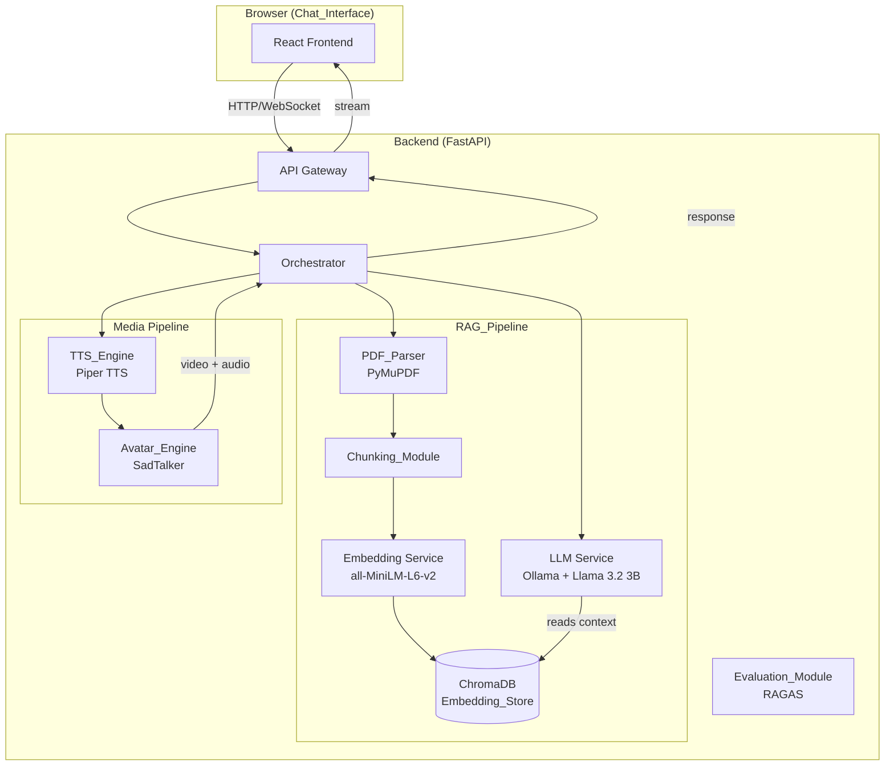
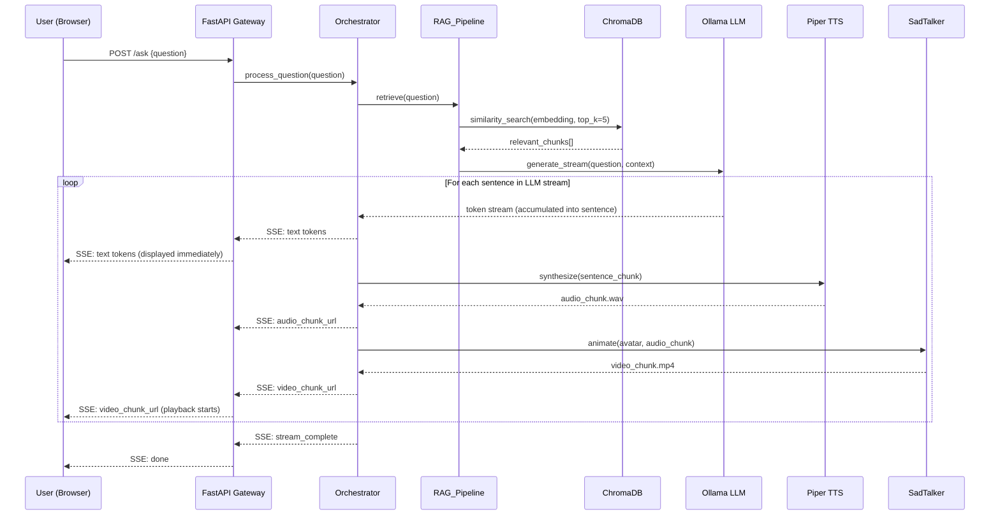
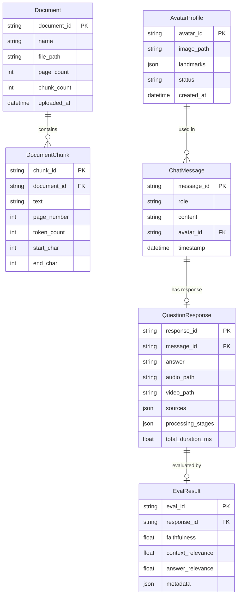

# Design Document: Live Talking Head Avatar

## Overview

The Live Talking Head Avatar system is an end-to-end conversational AI pipeline that transforms a static photograph into an animated, speaking avatar capable of answering questions from uploaded PDF documents. The system chains together four core AI subsystems — RAG-based question answering, text-to-speech synthesis, talking head video generation, and a web-based chat interface — all running locally on edge devices using open-source models and libraries.

The architecture follows a request-response orchestration pattern: a user question flows through the RAG pipeline to produce a text answer, the answer is converted to speech audio, and the audio drives facial animation on the uploaded avatar image. The resulting video is streamed back to the browser for playback.

Key design decisions:
- **Ollama + Llama 3.2 3B (Q4)** for the language model — small enough for 8 GB RAM edge devices, strong instruction-following capability
- **SadTalker** for talking head generation — CVPR 2023 model, single-image-to-video with audio-driven lip sync
- **Piper TTS** for speech synthesis — VITS-based, optimized for Raspberry Pi-class hardware, real-time on CPU
- **ChromaDB** for vector storage — embedded mode, no external server, persistent storage, Apache 2.0 license
- **all-MiniLM-L6-v2** for embeddings — 384-dimensional, ~80 MB model, fast inference on CPU
- **RAGAS** for RAG evaluation — open-source framework with faithfulness, relevance, and answer relevance metrics
- **FastAPI** for the backend — async support, automatic OpenAPI docs, lightweight
- **React** for the frontend — component-based UI, wide browser support

## Architecture

### System Architecture Diagram



### Request Flow (Streaming Pipeline)



### Component Interaction Pattern

The Orchestrator acts as the central coordinator, managing a **streaming pipeline** designed for minimal time-to-first-response:

1. **Retrieval phase** — embed the question, search ChromaDB, return top-5 chunks
2. **Generation phase (streaming)** — stream LLM tokens from Ollama; accumulate into sentence-level chunks
3. **Synthesis phase (pipelined)** — as each sentence completes, immediately synthesize it to audio via Piper TTS
4. **Animation phase (pipelined)** — as each audio chunk is ready, immediately generate a video segment via SadTalker
5. **Delivery phase (progressive)** — push text tokens, audio chunks, and video segments to the frontend via SSE as they become available

The pipeline overlaps phases: while sentence N is being animated, sentence N+1 is being synthesized, and sentence N+2 is still streaming from the LLM. This pipelining minimizes perceived latency — the user sees text immediately, hears audio within seconds, and sees the avatar animate shortly after.

Each phase is isolated behind a service interface, allowing independent testing and replacement.

## Components and Interfaces

### 1. Chat_Interface (Frontend)

**Technology:** React + TypeScript, Vite bundler

**Responsibilities:**
- File upload for avatar images (PNG/JPG/JPEG, ≤10 MB, ≥256×256)
- File upload for PDF documents (≤50 MB)
- Text input for questions
- Video playback with synchronized audio
- Chat history display
- Processing stage indicators
- Responsive layout (320px–1920px)

**API Contract (consumed):**

```
POST /api/upload/avatar
  Body: multipart/form-data { file: File }
  Response: { avatar_id: string, preview_url: string, landmarks_ready: boolean }

POST /api/upload/pdf
  Body: multipart/form-data { file: File }
  Response: { document_id: string, name: string, page_count: number, chunk_count: number }

POST /api/ask
  Body: { question: string, avatar_id: string }
  Response: text/event-stream (SSE)
    event: text_token    data: { token: string }
    event: audio_chunk   data: { chunk_url: string, chunk_index: number }
    event: video_chunk   data: { chunk_url: string, chunk_index: number }
    event: stage_update  data: { stage: string, duration_ms: number }
    event: sources       data: { sources: { chunk_text: string, page: number, score: float }[] }
    event: done          data: { total_duration_ms: number }

GET /api/health
  Response: { status: string, models_loaded: boolean, memory_usage_mb: number }
```

### 2. PDF_Parser

**Technology:** PyMuPDF (fitz) — Apache 2.0 license

**Interface:**
```python
class PDFParser:
    def parse(self, file_path: str) -> ParsedDocument:
        """Extract text and structure from PDF. Raises PDFParseError on failure."""
        ...

@dataclass
class ParsedDocument:
    text: str
    pages: list[PageContent]
    page_count: int
    metadata: dict

@dataclass  
class PageContent:
    page_number: int
    text: str
    tables: list[str]  # Markdown-formatted tables
```

### 3. Chunking_Module

**Technology:** LangChain RecursiveCharacterTextSplitter (with tiktoken tokenizer)

**Interface:**
```python
class ChunkingModule:
    def __init__(self, chunk_size: int = 512, chunk_overlap: int = 50):
        ...
    
    def chunk(self, document: ParsedDocument) -> list[DocumentChunk]:
        """Split parsed document into overlapping token-based chunks."""
        ...

@dataclass
class DocumentChunk:
    chunk_id: str
    text: str
    document_id: str
    page_number: int
    token_count: int
    start_char: int
    end_char: int
```

### 4. Embedding Service + Embedding_Store

**Technology:** sentence-transformers/all-MiniLM-L6-v2 (Apache 2.0), ChromaDB (Apache 2.0)

**Interface:**
```python
class EmbeddingStore:
    def __init__(self, collection_name: str, persist_directory: str):
        ...
    
    def add_chunks(self, chunks: list[DocumentChunk]) -> None:
        """Embed and store document chunks."""
        ...
    
    def search(self, query: str, top_k: int = 5) -> list[RetrievalResult]:
        """Semantic similarity search. Returns top-k results."""
        ...

@dataclass
class RetrievalResult:
    chunk: DocumentChunk
    score: float
    distance: float
```

### 5. LLM Service

**Technology:** Ollama serving Llama 3.2 3B (Q4_K_M quantization, ~2 GB disk)

**Interface:**
```python
class LLMService:
    def __init__(self, model_name: str = "llama3.2:3b", base_url: str = "http://localhost:11434"):
        ...
    
    def generate(self, question: str, context: list[RetrievalResult]) -> GenerationResult:
        """Generate answer from question and retrieved context."""
        ...
    
    def generate_stream(self, question: str, context: list[RetrievalResult]) -> Iterator[str]:
        """Stream tokens from the LLM. Yields individual tokens as they arrive."""
        ...

@dataclass
class GenerationResult:
    answer: str
    model: str
    prompt_tokens: int
    completion_tokens: int
    duration_ms: float
```

### 6. TTS_Engine

**Technology:** Piper TTS (MIT license) — VITS-based, ONNX runtime

**Interface:**
```python
class TTSEngine:
    def __init__(self, model_path: str, voice: str = "en_US-lessac-medium"):
        ...
    
    def synthesize(self, text: str) -> AudioResult:
        """Convert text to WAV audio. Sample rate ≥22050 Hz."""
        ...

@dataclass
class AudioResult:
    file_path: str
    duration_seconds: float
    sample_rate: int
    format: str  # "wav"
```

### 7. Avatar_Engine

**Technology:** SadTalker (MIT license) — 3DMM coefficients + face renderer

**Interface:**
```python
class AvatarEngine:
    def __init__(self, checkpoint_dir: str):
        ...
    
    def preprocess(self, image_path: str) -> AvatarProfile:
        """Extract facial landmarks and prepare avatar. Raises FaceNotFoundError."""
        ...
    
    def animate(self, profile: AvatarProfile, audio_path: str) -> VideoResult:
        """Generate lip-synced video from avatar profile and audio."""
        ...

@dataclass
class AvatarProfile:
    avatar_id: str
    image_path: str
    landmarks: dict
    preprocessed_at: str

@dataclass
class VideoResult:
    file_path: str
    duration_seconds: float
    fps: int
    resolution: tuple[int, int]
    format: str  # "mp4"
```

### 8. Orchestrator

**Technology:** Python async service coordinating all components

**Interface:**
```python
class Orchestrator:
    def __init__(self, config: AppConfig):
        ...
    
    async def process_question_stream(self, question: str, avatar_id: str) -> AsyncIterator[StreamEvent]:
        """Streaming pipeline: retrieve → stream generate → chunked synthesize → chunked animate.
        Yields StreamEvent objects (text_token, audio_chunk, video_chunk, stage_update, done)."""
        ...
    
    async def upload_avatar(self, file: UploadFile) -> AvatarProfile:
        """Validate and preprocess avatar image."""
        ...
    
    async def upload_pdf(self, file: UploadFile) -> DocumentSummary:
        """Parse, chunk, and embed PDF document."""
        ...

@dataclass
class StreamEvent:
    type: str  # "text_token" | "audio_chunk" | "video_chunk" | "stage_update" | "error" | "done"
    data: dict  # payload varies by type

@dataclass
class OrchestratorResponse:
    answer: str
    audio_url: str
    video_url: str
    sources: list[RetrievalResult]
    stages: list[ProcessingStage]

@dataclass
class ProcessingStage:
    name: str
    duration_ms: float
    status: str  # "success" | "error"
```

### 9. Evaluation_Module

**Technology:** RAGAS (Apache 2.0) with local Ollama LLM as evaluator

**Interface:**
```python
class EvaluationModule:
    def __init__(self, llm_service: LLMService):
        ...
    
    def evaluate_single(self, question: str, answer: str, context: list[str]) -> EvalResult:
        """Evaluate a single QA pair."""
        ...
    
    def evaluate_dataset(self, dataset_path: str) -> list[EvalResult]:
        """Run evaluation on a test dataset (JSON file)."""
        ...

@dataclass
class EvalResult:
    question: str
    faithfulness: float
    context_relevance: float
    answer_relevance: float
    metadata: dict
```

## Data Models

### Core Entities



### Configuration Schema

```python
@dataclass
class AppConfig:
    # RAG settings
    chunk_size: int = 512
    chunk_overlap: int = 50
    retrieval_top_k: int = 5
    embedding_model: str = "all-MiniLM-L6-v2"
    
    # LLM settings
    llm_model: str = "llama3.2:3b"
    llm_base_url: str = "http://localhost:11434"
    llm_temperature: float = 0.1
    llm_max_tokens: int = 512
    
    # TTS settings
    tts_model_path: str = "./models/piper/en_US-lessac-medium.onnx"
    tts_sample_rate: int = 22050
    
    # Avatar settings
    avatar_checkpoint_dir: str = "./models/sadtalker/"
    avatar_fps: int = 25
    avatar_resolution: tuple[int, int] = (256, 256)
    
    # Storage
    chroma_persist_dir: str = "./data/chroma"
    media_output_dir: str = "./data/media"
    
    # Validation limits
    max_image_size_mb: int = 10
    max_pdf_size_mb: int = 50
    min_image_resolution: tuple[int, int] = (256, 256)
    allowed_image_formats: list[str] = field(default_factory=lambda: ["png", "jpg", "jpeg"])
```

### File Storage Layout

```
data/
├── avatars/
│   └── {avatar_id}/
│       ├── original.{ext}
│       └── landmarks.json
├── documents/
│   └── {document_id}/
│       └── original.pdf
├── chroma/                  # ChromaDB persistent storage
├── media/
│   └── {response_id}/
│       ├── audio.wav
│       └── video.mp4
└── eval/
    └── test_dataset.json
```

### Model Disk Budget

| Model | Size | License |
|-------|------|---------|
| Llama 3.2 3B (Q4_K_M) | ~2.0 GB | Llama 3.2 Community License |
| SadTalker checkpoints | ~1.5 GB | MIT |
| Piper TTS (en_US-lessac-medium) | ~60 MB | MIT |
| all-MiniLM-L6-v2 | ~80 MB | Apache 2.0 |
| **Total** | **~3.6 GB** | — |

This leaves ~6.4 GB headroom within the 10 GB disk budget for application code, dependencies, Docker layers, and runtime data.
