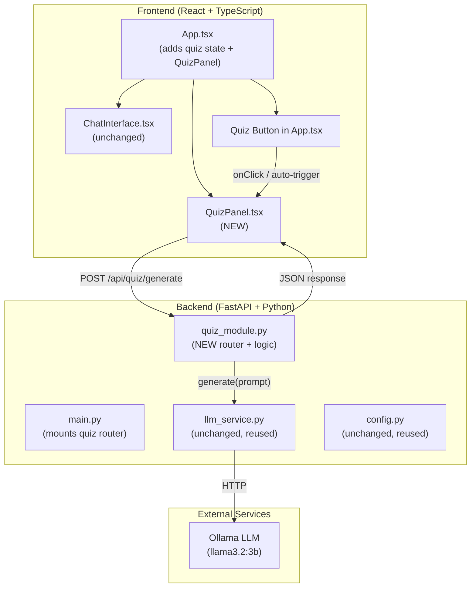
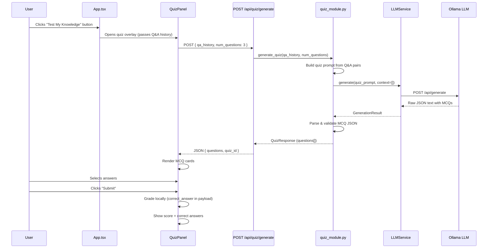
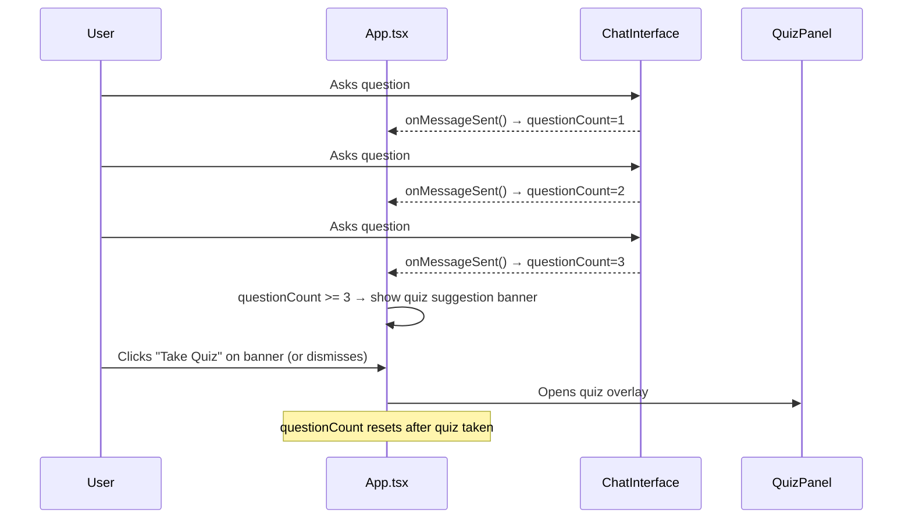

# Design Document: Session Knowledge Quiz

## Overview

The Session Knowledge Quiz is a self-contained module that tests a user's understanding of material covered during a chat session. After the user has asked 3–4 questions (or on demand via a UI button), the system generates 2–3 multiple-choice questions (MCQs) derived from the session's Q&A history, presents them in an interactive overlay, verifies the answers, and displays a score summary.

The module is designed as a **fully isolated add-on** — a new backend router and a new frontend component — that plugs into the existing AI Gurukul application without modifying any existing files. The backend exposes a single new endpoint that accepts the session's conversation history and returns generated quiz questions. The frontend adds a quiz panel component and a trigger button, both wired into the existing `App.tsx` through composition (new state + new component rendering) rather than modifying existing component internals.

Key design decisions:
- **Separate module**: New files only (`backend/app/quiz_module.py`, `frontend/src/components/QuizPanel.tsx`, etc.). Existing orchestrator, models, and endpoints remain untouched.
- **LLM-generated MCQs**: Reuses the existing Ollama LLM (via `LLMService`) with a quiz-specific prompt to generate questions from conversation context.
- **Stateless backend**: The frontend sends the full Q&A history with each quiz request — no server-side session storage needed.
- **Question count tracking**: The frontend tracks how many questions the user has asked and auto-prompts after 3–4 questions.

## Architecture



## Sequence Diagrams

### Quiz Generation Flow (Button Trigger)



### Auto-Trigger Flow (After 3–4 Questions)



## Components and Interfaces

### Component 1: Quiz Module — Backend (`backend/app/quiz_module.py`)

**Purpose**: Standalone FastAPI router that generates MCQ questions from session Q&A history using the LLM.

**Interface**:
```python
from fastapi import APIRouter

router = APIRouter(prefix="/api/quiz", tags=["Quiz"])

@router.post("/generate", response_model=QuizResponse)
async def generate_quiz(body: QuizRequest) -> QuizResponse:
    """Generate MCQ questions from session Q&A history."""
    ...
```

**Responsibilities**:
- Accept Q&A history and desired question count
- Build a structured prompt instructing the LLM to produce MCQs in JSON format
- Call `LLMService.generate()` (non-streaming, since quiz is a one-shot response)
- Parse the LLM output into validated `QuizQuestion` objects
- Return structured quiz data including correct answers (for client-side grading)

### Component 2: Quiz Panel — Frontend (`frontend/src/components/QuizPanel.tsx`)

**Purpose**: Modal/overlay component that displays MCQ questions, collects answers, grades them, and shows the score.

**Interface**:
```typescript
interface QuizPanelProps {
  qaHistory: Array<{ question: string; answer: string }>;
  onClose: () => void;
  onQuizComplete: (score: number, total: number) => void;
}

export default function QuizPanel({ qaHistory, onClose, onQuizComplete }: QuizPanelProps): JSX.Element;
```

**Responsibilities**:
- Call `POST /api/quiz/generate` with the Q&A history on mount
- Display a loading state while the LLM generates questions
- Render each MCQ with radio-button options
- Track user selections
- On submit: compare selections to correct answers, compute score
- Display score summary with correct/incorrect indicators
- Notify parent via `onQuizComplete` callback

### Component 3: Quiz API Client (`frontend/src/api.ts` additions)

**Purpose**: Type-safe API function for the quiz endpoint. Added as a new export — no existing exports modified.

**Interface**:
```typescript
export interface QuizQuestion {
  id: number;
  question: string;
  options: string[];
  correct_answer: number; // 0-based index
  explanation: string;
}

export interface QuizGenerateResponse {
  quiz_id: string;
  questions: QuizQuestion[];
}

export async function generateQuiz(
  qaHistory: Array<{ question: string; answer: string }>,
  numQuestions?: number
): Promise<QuizGenerateResponse>;
```

### Component 4: App-Level Integration (`App.tsx` additions)

**Purpose**: Adds quiz state management and the trigger button/banner to the existing App component.

**New State & Logic**:
```typescript
// New state added to App.tsx
const [questionCount, setQuestionCount] = useState(0);
const [showQuiz, setShowQuiz] = useState(false);
const [qaHistory, setQaHistory] = useState<Array<{ question: string; answer: string }>>([]);
const [showQuizSuggestion, setShowQuizSuggestion] = useState(false);
```

**Responsibilities**:
- Track `questionCount` (incremented each time ChatInterface completes a Q&A)
- Accumulate `qaHistory` from completed Q&A exchanges
- Show a suggestion banner when `questionCount >= 3`
- Render a persistent "Test My Knowledge" button when `qaHistory.length > 0`
- Mount/unmount `QuizPanel` based on `showQuiz` state
- Reset `questionCount` after a quiz is completed

## Data Models

### Backend Models (`backend/app/quiz_module.py`)

```python
from pydantic import BaseModel, Field

class QAPair(BaseModel):
    """A single question-answer exchange from the session."""
    question: str
    answer: str

class QuizRequest(BaseModel):
    """Request body for quiz generation."""
    qa_history: list[QAPair] = Field(..., min_length=1, max_length=50)
    num_questions: int = Field(default=3, ge=1, le=5)

class QuizOption(BaseModel):
    """A single MCQ option."""
    index: int
    text: str

class QuizQuestion(BaseModel):
    """A generated multiple-choice question."""
    id: int
    question: str
    options: list[QuizOption] = Field(..., min_length=2, max_length=4)
    correct_answer: int  # 0-based index into options
    explanation: str

class QuizResponse(BaseModel):
    """Response containing generated quiz questions."""
    quiz_id: str
    questions: list[QuizQuestion]
```

**Validation Rules**:
- `qa_history` must have at least 1 entry and at most 50
- `num_questions` must be between 1 and 5 (default 3)
- Each `QuizQuestion` must have 2–4 options
- `correct_answer` must be a valid index within the options list
- `explanation` provides reasoning for the correct answer

### Frontend Types (`frontend/src/api.ts`)

```typescript
export interface QuizQuestion {
  id: number;
  question: string;
  options: Array<{ index: number; text: string }>;
  correct_answer: number;
  explanation: string;
}

export interface QuizGenerateResponse {
  quiz_id: string;
  questions: QuizQuestion[];
}
```

## Algorithmic Pseudocode

### Quiz Generation Algorithm

```python
def generate_quiz(qa_history: list[QAPair], num_questions: int) -> QuizResponse:
    """
    Generate MCQ questions from session Q&A history.
    
    Preconditions:
        - len(qa_history) >= 1
        - 1 <= num_questions <= 5
        - LLM service is reachable
    
    Postconditions:
        - Returns QuizResponse with len(questions) == num_questions
          (or fewer if LLM produces fewer valid questions)
        - Each question has 4 options with exactly 1 correct answer
        - Questions are derived from the provided Q&A history
    """
    # Step 1: Build the quiz generation prompt
    prompt = build_quiz_prompt(qa_history, num_questions)
    
    # Step 2: Call LLM (non-streaming)
    result = llm_service.generate(prompt, context=[])
    raw_text = result.answer
    
    # Step 3: Extract JSON from LLM response
    json_str = extract_json_from_response(raw_text)
    
    # Step 4: Parse and validate questions
    questions = parse_and_validate_questions(json_str, num_questions)
    
    # Step 5: Return structured response
    return QuizResponse(
        quiz_id=generate_uuid(),
        questions=questions
    )
```

### Prompt Construction Algorithm

```python
def build_quiz_prompt(qa_history: list[QAPair], num_questions: int) -> str:
    """
    Build a structured prompt that instructs the LLM to generate MCQs.
    
    Preconditions:
        - qa_history is non-empty
        - num_questions >= 1
    
    Postconditions:
        - Returns a string prompt containing all Q&A context
        - Prompt explicitly requests JSON output format
        - Prompt specifies exactly num_questions questions with 4 options each
    """
    context_block = ""
    for i, pair in enumerate(qa_history, 1):
        context_block += f"Q{i}: {pair.question}\nA{i}: {pair.answer}\n\n"
    
    prompt = f"""Based on the following Q&A session, generate exactly {num_questions} multiple-choice questions to test the user's understanding.

SESSION HISTORY:
{context_block}

RULES:
- Each question must have exactly 4 options (A, B, C, D)
- Exactly one option must be correct
- Questions should test comprehension, not just recall
- Include a brief explanation for each correct answer
- Respond ONLY with valid JSON in this exact format:

[
  {{
    "question": "...",
    "options": ["A) ...", "B) ...", "C) ...", "D) ..."],
    "correct_answer": 0,
    "explanation": "..."
  }}
]"""
    
    return prompt
```

### JSON Extraction and Validation Algorithm

```python
def extract_json_from_response(raw_text: str) -> str:
    """
    Extract JSON array from LLM response text.
    
    Preconditions:
        - raw_text is a non-empty string
    
    Postconditions:
        - Returns a valid JSON string containing an array
        - Raises ValueError if no valid JSON found
    
    Loop Invariants:
        - N/A (no loops; uses regex extraction)
    """
    # Try direct JSON parse first
    try:
        json.loads(raw_text)
        return raw_text
    except json.JSONDecodeError:
        pass
    
    # Extract JSON from markdown code blocks
    match = re.search(r'```(?:json)?\s*(\[.*?\])\s*```', raw_text, re.DOTALL)
    if match:
        return match.group(1)
    
    # Extract bare JSON array
    match = re.search(r'\[.*\]', raw_text, re.DOTALL)
    if match:
        return match.group(0)
    
    raise ValueError("No valid JSON array found in LLM response")


def parse_and_validate_questions(
    json_str: str, num_questions: int
) -> list[QuizQuestion]:
    """
    Parse JSON string into validated QuizQuestion objects.
    
    Preconditions:
        - json_str is a valid JSON string containing an array
        - num_questions >= 1
    
    Postconditions:
        - Returns list of QuizQuestion objects
        - len(result) <= num_questions
        - Each question has 2-4 options
        - Each correct_answer is a valid index
    
    Loop Invariants:
        - All previously validated questions have valid structure
    """
    raw_questions = json.loads(json_str)
    validated = []
    
    for i, raw in enumerate(raw_questions[:num_questions]):
        # Validate required fields exist
        if not all(k in raw for k in ("question", "options", "correct_answer")):
            continue
        
        options = raw["options"]
        correct_idx = int(raw["correct_answer"])
        
        # Validate option count and correct_answer index
        if not (2 <= len(options) <= 4):
            continue
        if not (0 <= correct_idx < len(options)):
            correct_idx = 0  # fallback to first option
        
        validated.append(QuizQuestion(
            id=i,
            question=raw["question"],
            options=[
                QuizOption(index=j, text=opt)
                for j, opt in enumerate(options)
            ],
            correct_answer=correct_idx,
            explanation=raw.get("explanation", "")
        ))
    
    return validated
```

### Client-Side Grading Algorithm

```typescript
function gradeQuiz(
  questions: QuizQuestion[],
  userAnswers: Map<number, number>  // questionId → selected option index
): { score: number; total: number; results: QuestionResult[] } {
  /**
   * Preconditions:
   *   - questions.length > 0
   *   - userAnswers has an entry for each question.id
   *
   * Postconditions:
   *   - score <= total
   *   - total === questions.length
   *   - Each result indicates correct/incorrect with explanation
   *
   * Loop Invariants:
   *   - score <= number of questions processed so far
   */
  let score = 0;
  const results: QuestionResult[] = [];

  for (const q of questions) {
    const selected = userAnswers.get(q.id) ?? -1;
    const isCorrect = selected === q.correct_answer;
    if (isCorrect) score++;

    results.push({
      questionId: q.id,
      selectedAnswer: selected,
      correctAnswer: q.correct_answer,
      isCorrect,
      explanation: q.explanation,
    });
  }

  return { score, total: questions.length, results };
}
```

## Key Functions with Formal Specifications

### Function 1: `generate_quiz_endpoint()`

```python
async def generate_quiz_endpoint(body: QuizRequest) -> QuizResponse:
```

**Preconditions:**
- `body.qa_history` has 1–50 entries
- `body.num_questions` is between 1 and 5
- Ollama LLM is reachable at the configured URL

**Postconditions:**
- Returns `QuizResponse` with `quiz_id` (UUID) and `questions` list
- `len(questions)` ≤ `body.num_questions` (may be fewer if LLM output is malformed)
- Each question has 2–4 options with a valid `correct_answer` index
- On LLM failure: raises HTTP 503 with descriptive error

**Loop Invariants:** N/A

### Function 2: `build_quiz_prompt()`

```python
def build_quiz_prompt(qa_history: list[QAPair], num_questions: int) -> str:
```

**Preconditions:**
- `qa_history` is non-empty
- `num_questions` ≥ 1

**Postconditions:**
- Returns a prompt string containing all Q&A pairs
- Prompt includes explicit JSON format instructions
- Prompt specifies the exact number of questions to generate

**Loop Invariants:**
- Each Q&A pair is appended in order with consistent formatting

### Function 3: `extract_json_from_response()`

```python
def extract_json_from_response(raw_text: str) -> str:
```

**Preconditions:**
- `raw_text` is a non-empty string from LLM output

**Postconditions:**
- Returns a string that is valid JSON (parseable by `json.loads`)
- The JSON represents a list/array
- Raises `ValueError` if no valid JSON can be extracted

**Loop Invariants:** N/A

## Example Usage

### Backend — Quiz Generation

```python
# In quiz_module.py — the endpoint handler
from backend.app.config import load_config
from backend.app.llm_service import LLMService

config = load_config()
llm = LLMService(config=config)

# Example request
request = QuizRequest(
    qa_history=[
        QAPair(question="What is photosynthesis?",
               answer="Photosynthesis is the process by which plants convert sunlight into energy."),
        QAPair(question="What are the products of photosynthesis?",
               answer="The products are glucose and oxygen."),
        QAPair(question="Where does photosynthesis occur?",
               answer="It occurs in the chloroplasts of plant cells."),
    ],
    num_questions=2
)

# Generate quiz
response = await generate_quiz_endpoint(request)
# response.questions = [
#   QuizQuestion(id=0, question="What organelle is responsible for photosynthesis?",
#                options=[...], correct_answer=2, explanation="Chloroplasts contain..."),
#   QuizQuestion(id=1, question="Which of the following is a product of photosynthesis?",
#                options=[...], correct_answer=1, explanation="Glucose and oxygen are..."),
# ]
```

### Frontend — Quiz Panel Usage

```typescript
// In App.tsx — mounting the quiz panel
{showQuiz && qaHistory.length > 0 && (
  <QuizPanel
    qaHistory={qaHistory}
    onClose={() => setShowQuiz(false)}
    onQuizComplete={(score, total) => {
      console.log(`Score: ${score}/${total}`);
      setShowQuiz(false);
      setQuestionCount(0); // reset counter
    }}
  />
)}

// Quiz trigger button (always visible when there's history)
{qaHistory.length > 0 && !processing && (
  <button onClick={() => setShowQuiz(true)}>
    🧠 Test My Knowledge
  </button>
)}

// Auto-suggestion banner after 3 questions
{showQuizSuggestion && (
  <div className="quiz-suggestion-banner">
    <p>You've asked {questionCount} questions. Ready to test your knowledge?</p>
    <button onClick={() => { setShowQuiz(true); setShowQuizSuggestion(false); }}>
      Take Quiz
    </button>
    <button onClick={() => setShowQuizSuggestion(false)}>
      Later
    </button>
  </div>
)}
```

## Correctness Properties

1. **∀ quiz response R**: `len(R.questions) ≤ request.num_questions` — the system never returns more questions than requested.

2. **∀ question Q in R.questions**: `0 ≤ Q.correct_answer < len(Q.options)` — the correct answer index is always valid.

3. **∀ question Q in R.questions**: `2 ≤ len(Q.options) ≤ 4` — every question has between 2 and 4 options.

4. **∀ grading result G**: `G.score ≤ G.total` and `G.total == len(questions)` — score never exceeds total.

5. **∀ quiz request with empty qa_history**: the backend returns HTTP 422 (Pydantic validation) — you cannot generate a quiz from nothing.

6. **Isolation property**: No existing endpoint (`/api/ask`, `/api/upload/*`, `/api/health`, `/api/reset`) is modified. The quiz module is additive only.

7. **∀ Q&A pair in qa_history**: the pair appears in the LLM prompt — no session context is silently dropped.

8. **Idempotency of grading**: Given the same `questions` and `userAnswers`, `gradeQuiz()` always returns the same `score` and `results`.

## Error Handling

### Error Scenario 1: LLM Unreachable

**Condition**: Ollama server is down or not responding when quiz generation is requested.
**Response**: Backend returns HTTP 503 with `{"detail": "Quiz generation service unavailable. Please try again later."}`.
**Recovery**: Frontend displays an error message in the quiz panel with a "Retry" button. User can dismiss and continue chatting.

### Error Scenario 2: LLM Returns Malformed Output

**Condition**: The LLM response does not contain valid JSON or the JSON structure doesn't match the expected MCQ format.
**Response**: Backend attempts three extraction strategies (direct parse → code block extraction → bare array extraction). If all fail, returns HTTP 502 with `{"detail": "Failed to generate valid quiz questions. Please try again."}`.
**Recovery**: Frontend shows error with retry option. A retry often succeeds since LLM output varies.

### Error Scenario 3: Fewer Questions Than Requested

**Condition**: LLM generates fewer valid questions than `num_questions` (e.g., some entries fail validation).
**Response**: Backend returns whatever valid questions were parsed (could be 1 instead of 3). The response is still valid.
**Recovery**: Frontend renders the available questions. If zero valid questions, shows "Couldn't generate questions — try asking more questions first."

### Error Scenario 4: Empty Q&A History

**Condition**: User triggers quiz before any Q&A exchanges have occurred.
**Response**: Pydantic validation rejects the request with HTTP 422 (`qa_history` min_length=1).
**Recovery**: Frontend disables the quiz button when `qaHistory.length === 0`. The button only appears after at least one completed Q&A.

### Error Scenario 5: Network Error During Quiz Fetch

**Condition**: Network failure between frontend and backend during the quiz generation request.
**Response**: Frontend `fetch` throws an error.
**Recovery**: QuizPanel catches the error, displays "Connection failed" with a retry button.

## Testing Strategy

### Unit Testing Approach

**Backend (`backend/app/test_quiz_module.py`)**:
- Test `build_quiz_prompt()` produces correct prompt structure with all Q&A pairs included
- Test `extract_json_from_response()` with: valid JSON, JSON in code blocks, bare JSON array, no JSON (expect ValueError)
- Test `parse_and_validate_questions()` with: valid input, missing fields, out-of-range correct_answer, too many/few options
- Test endpoint validation: empty qa_history (422), num_questions out of range (422)
- Test endpoint with mocked LLM returning valid/invalid responses
- Target: ≥90% coverage of `quiz_module.py`

**Frontend (`frontend/src/components/QuizPanel.test.tsx`)**:
- Test rendering: loading state, questions display, score display
- Test interaction: selecting options, submitting, closing
- Test grading logic: all correct, all wrong, mixed
- Test error states: API failure, empty response
- Test accessibility: keyboard navigation, ARIA labels

### Integration Testing Approach

- Test full flow: POST to `/api/quiz/generate` with realistic Q&A history, verify response structure
- Test with actual LLM (if available in CI) to verify prompt produces reasonable MCQs
- Test that existing endpoints (`/api/ask`, `/api/health`) still work after quiz module is mounted

## Performance Considerations

- **LLM call latency**: Quiz generation uses a single non-streaming LLM call. With llama3.2:3b, expect 2–5 seconds for 2–3 MCQs. The frontend shows a loading spinner during this time.
- **Prompt size**: The Q&A history is included in the prompt. With a 50-pair cap and typical answer lengths (~150 tokens each), the prompt stays well within the model's context window.
- **No additional storage**: Quiz data is ephemeral — generated on request, graded client-side, not persisted. No database or file system impact.
- **No impact on existing pipeline**: The quiz endpoint is completely independent of the streaming Q&A pipeline. Concurrent quiz generation and Q&A are supported.

## Security Considerations

- **Input validation**: Pydantic models enforce field types, lengths, and ranges. The `qa_history` is capped at 50 entries to prevent prompt injection via extremely long histories.
- **No user data persistence**: Quiz questions and answers are not stored server-side. They exist only for the duration of the HTTP request/response cycle.
- **LLM prompt injection**: The quiz prompt is constructed server-side with the Q&A history embedded as context. The prompt structure uses clear delimiters to reduce injection risk from user-supplied question text.
- **CORS**: Inherits the existing CORS configuration from `main.py`.

## Dependencies

**Backend** (no new dependencies):
- `fastapi` — already installed (for the new router)
- `pydantic` — already installed (for request/response models)
- `httpx` — already installed (used by `LLMService`)
- `backend.app.llm_service.LLMService` — reused for LLM calls
- `backend.app.config.load_config` — reused for configuration

**Frontend** (no new dependencies):
- `react` — already installed (for the QuizPanel component)
- No additional npm packages required

**New Files Created**:
| File | Purpose |
|------|---------|
| `backend/app/quiz_module.py` | FastAPI router + quiz generation logic |
| `backend/app/test_quiz_module.py` | Unit tests for quiz module |
| `frontend/src/components/QuizPanel.tsx` | Quiz overlay UI component |
| `frontend/src/components/QuizPanel.test.tsx` | Tests for QuizPanel |

**Existing Files Modified (minimal, additive only)**:
| File | Change |
|------|--------|
| `backend/app/main.py` | Add 2 lines: import quiz router + `app.include_router()` |
| `frontend/src/App.tsx` | Add quiz state, trigger button, QuizPanel mount |
| `frontend/src/api.ts` | Add `generateQuiz()` function + quiz types |
