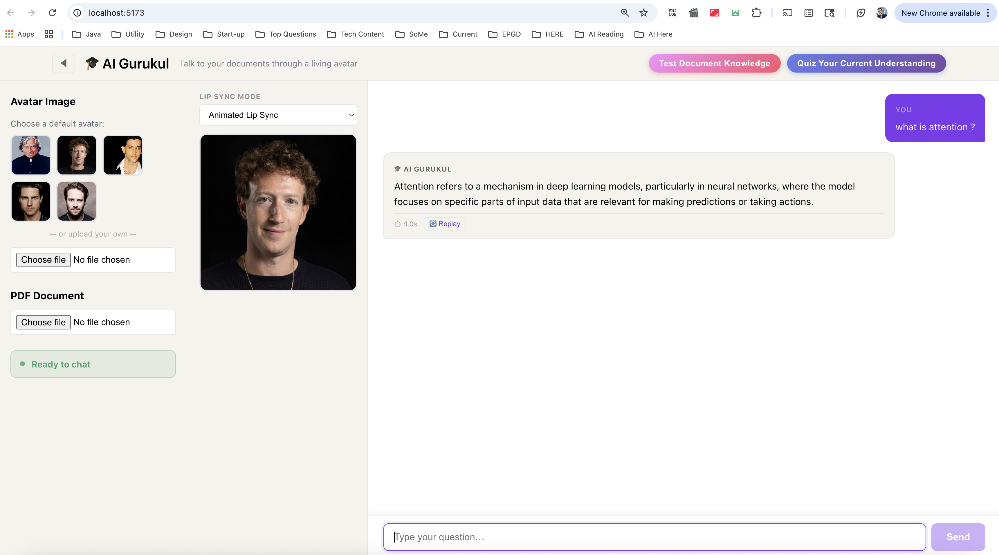

<h1 align="center">🎓 AI Gurukul</h1>

<p align="center">
  <strong>An AI-powered learning portal that teaches you through a living avatar.</strong>
</p>

<p align="center">
  Upload a photograph. Upload your PDFs. Ask questions. Take quizzes.<br/>
  The avatar reads your documents, speaks the answer, moves its lips, and tests your understanding — all running locally on your machine.
</p>


<p align="center">
  
  
  
  
  
  
</p>

---

## What is AI Gurukul?

AI Gurukul is an end-to-end **multimodal AI learning system** that chains together six AI/ML technologies into a seamless educational experience. It goes beyond simple Q&A — it actively tests your understanding through AI-generated quizzes, tracks your learning progress, and adapts to your session context.

### The AI/ML Pipeline

| Step | What happens | AI/ML Technology | Model Details |
|------|-------------|-----------------|---------------|
| **1. Understand** | PDF documents are parsed, chunked, and embedded into a vector store | **Semantic Embeddings** — sentence-transformers | `all-MiniLM-L6-v2` · 384-dim · ~80 MB |
| **2. Retrieve** | User questions are embedded and matched against document chunks via cosine similarity | **Vector Search** — ChromaDB HNSW index | Top-k retrieval with cosine distance scoring |
| **3. Think** | A local LLM receives retrieved context and generates a concise, factual answer | **LLM Inference** — Ollama runtime | `llama3.2:3b` Q4_K_M quantized · ~2 GB |
| **4. Speak** | The text answer is converted to natural, high-quality speech in real time | **Neural Text-to-Speech** — Edge-TTS / Piper TTS | Microsoft neural voices · ONNX runtime |
| **5. Animate** | Your uploaded photograph comes alive with synchronized lip movements | **Neural Lip Sync** — Wav2Lip GAN | Face detection + GAN-based mouth synthesis · ~416 MB |
| **6. Assess** | AI generates MCQ quizzes from document content and session Q&A to test understanding | **LLM-Powered Quiz Generation** — direct Ollama inference | Structured JSON generation with validation |

---

## AI/ML Architecture Deep Dive

### Retrieval-Augmented Generation (RAG)

The core Q&A pipeline uses a **RAG architecture** that grounds LLM responses in document facts:

```
PDF → PyMuPDF Parser → LangChain Chunker (512 tokens, 50 overlap)
    → sentence-transformers Encoder → ChromaDB Vector Store
                                            ↓
User Question → Embedding → Cosine Similarity Search (top-5)
    → Context + Question → Llama 3.2 3B → Factual Answer
```

- **Chunking strategy**: 512-token chunks with 50-token overlap using tiktoken tokenizer, ensuring no context is lost at chunk boundaries
- **Embedding model**: `all-MiniLM-L6-v2` produces 384-dimensional dense vectors optimized for semantic similarity
- **Vector store**: ChromaDB with HNSW (Hierarchical Navigable Small World) index for sub-millisecond approximate nearest neighbor search
- **LLM inference**: Ollama serves Llama 3.2 3B with 4-bit quantization (Q4_K_M), enabling inference on CPU with ~2 GB memory footprint
- **Evaluation**: Built-in RAGAS metrics (faithfulness, context relevance, answer relevance) for benchmarking retrieval quality

### Neural Lip Sync (Wav2Lip)

Two animation modes powered by the **Wav2Lip GAN**:

| Mode | How it works | Latency | Use case |
|------|-------------|---------|----------|
| **Animated** | Pre-generates 5 neural viseme images (idle, a, e, o, m) using Wav2Lip + Poisson seamless cloning at upload time. Canvas renderer swaps frames at 60fps synced to audio phonemes. | ~2s | Real-time conversation |
| **Real** | Full Wav2Lip video generation — the GAN synthesizes mouth movements frame-by-frame for the complete answer audio. | ~20-30s | Presentation quality |

The Wav2Lip model uses a **discriminator-guided GAN** that takes a face image + audio spectrogram as input and produces photorealistic lip movements. Face detection uses OpenCV's DNN module with a pre-trained Caffe model.

### Neural Text-to-Speech

- **Primary**: Edge-TTS — Microsoft's neural voice synthesis API (free, no API key). Produces natural prosody with ~1s latency per sentence.
- **Fallback**: Piper TTS — fully offline ONNX-based synthesis using the `en_US-lessac-medium` voice model (~60 MB).
- Audio is generated per-sentence for streaming playback — the avatar starts speaking before the full answer is complete.

### AI-Powered Quiz Generation

The quiz system uses **direct LLM inference** (bypassing the RAG system prompt) to generate structured MCQ assessments:

```
Session Q&A History  ──→  Quiz Prompt  ──→  Llama 3.2 3B  ──→  JSON MCQs
Document Chunks      ──→  Doc Prompt   ──→  Llama 3.2 3B  ──→  JSON MCQs
                                                                    ↓
                                                          Validation + Repair
                                                                    ↓
                                                          Interactive Quiz UI
```

**Two quiz modes**:
1. **Document Knowledge Quiz** (📄) — generates 10 MCQs from the full document content. Tests baseline understanding before the user starts learning. Questions are generated in batches of 3 to avoid LLM output truncation.
2. **Session Understanding Quiz** (🧠) — generates MCQs from the rolling Q&A session history. Tests what the user has actually learned through conversation. Context grows with each new Q&A exchange.

**Technical details**:
- Direct Ollama HTTP calls with `temperature=0.6` and `num_predict=2048` for structured JSON output
- Multi-strategy JSON extraction: direct parse → markdown code block → bare array → truncated JSON repair (brace-matching salvage)
- Pydantic validation with graceful degradation — malformed questions are skipped, not failed
- Client-side grading with instant visual feedback (green/red flash per question)

---

## Features

### Learning & Assessment
- **Document Knowledge Quiz** — 10-question assessment from uploaded document content (pre-learning baseline)
- **Session Understanding Quiz** — rolling quiz from Q&A session history (post-learning evaluation)
- **Instant feedback** — green/red flash with explanation on each answer selection
- **Progressive learning** — quiz context grows as you ask more questions
- **Score tracking** — running score displayed in header throughout the session

### Conversational AI
- **Any face, any document** — upload any photo with a face and any PDF
- **Dual lip-sync modes** — fast animated visemes or high-quality Wav2Lip video
- **Real-time streaming** — text tokens stream autoregressively via SSE
- **Session cache** — duplicate questions are detected and answered instantly with "You Already Asked This" + cached response and audio replay
- **Edge-TTS** — high-quality Microsoft neural voice synthesis (free, no API key)

### User Experience
- **Flashing quiz buttons** — header buttons pulse when they become available, drawing attention
- **Collapsible sidebar** — auto-collapses when chatting starts for more screen space
- **Response time tracking** — latency shown next to each answer
- **Replay button** — replay any previous answer with lip-sync animation
- **Session cleanup** — auto-cleans temp data on browser close and server shutdown

### Engineering
- **Fully local** — no cloud APIs, no paid services, all data stays on your machine
- **Edge-optimized** — runs on 8 GB RAM, 4-core CPU, no GPU required
- **RAG evaluation** — built-in RAGAS metrics with CLI benchmarking
- **Production patterns** — structured logging, correlation IDs, error handling
- **200+ tests** — property-based tests (Hypothesis/fast-check), unit tests, integration tests

---

## Architecture

```
┌─────────────────────────────────────────────────────────────────────┐
│                     Browser (React + Canvas)                        │
│  ┌──────────┐  ┌──────────┐  ┌──────────┐  ┌─────────────────────┐  │
│  │ Sidebar  │  │  Canvas  │  │   Chat   │  │  Quiz Panel/Modal   │  │
│  │ (upload) │  │ (avatar) │  │ (stream) │  │  (doc + session)    │  │
│  └──────────┘  └──────────┘  └──────────┘  └─────────────────────┘  │
│                    Session Cache (Map<question, response>)           │
└────────────────────────┬────────────────────────────────────────────┘
                         │ SSE + REST
                         ▼
┌─────────────────────────────────────────────────────────────────────┐
│                     FastAPI Backend                                  │
│                                                                     │
│  ┌─────────────────── Orchestrator ──────────────────────────────┐  │
│  │  Animated: Retrieve → Stream LLM → Edge-TTS → viseme canvas  │  │
│  │  Real:     Retrieve → Stream LLM → Edge-TTS → Wav2Lip video  │  │
│  └───────────────────────────────────────────────────────────────┘  │
│                                                                     │
│  ┌──────────┐  ┌──────────┐  ┌──────────┐  ┌──────────────────┐    │
│  │PDF Parser│  │Embedding │  │  Viseme  │  │  Quiz Module     │    │
│  │(PyMuPDF) │  │  Store   │  │  Engine  │  │  (LLM → JSON)   │    │
│  └──────────┘  └──────────┘  └──────────┘  └──────────────────┘    │
│                                                                     │
│  ┌──────────┐  ┌──────────┐  ┌──────────┐  ┌──────────────────┐    │
│  │LLM Svc  │  │Edge-TTS  │  │Wav2Lip   │  │  Evaluation      │    │
│  │(Ollama)  │  │(Neural)  │  │(GAN)     │  │  (RAGAS)         │    │
│  └──────────┘  └──────────┘  └──────────┘  └──────────────────┘    │
└─────────────────────────────────────────────────────────────────────┘
         │              │              │
         ▼              ▼              ▼
   ┌──────────┐  ┌──────────┐  ┌──────────────┐
   │  Ollama  │  │ChromaDB  │  │  Wav2Lip     │
   │  LLM     │  │  Vector  │  │  Checkpoint  │
   │  Server  │  │  Store   │  │  (~416 MB)   │
   └──────────┘  └──────────┘  └──────────────┘
```

---

## Tech Stack

| Layer | Technology | Purpose |
|-------|-----------|---------|
| **Frontend** | React 19 · TypeScript · Vite · Canvas API | Chat UI, viseme animation, quiz panels, video playback |
| **Backend** | FastAPI · Python 3.10 | API gateway, streaming orchestration, quiz generation |
| **LLM** | Ollama · Llama 3.2 3B (Q4_K_M) | Question answering + quiz MCQ generation (~2 GB) |
| **Embeddings** | all-MiniLM-L6-v2 (sentence-transformers) | Semantic search (384-dim, ~80 MB) |
| **Vector Store** | ChromaDB (HNSW index) | Persistent document embeddings + document quiz retrieval |
| **TTS (primary)** | Edge-TTS | High-quality Microsoft neural voice (free, ~1s per sentence) |
| **TTS (fallback)** | Piper TTS (ONNX) | Offline speech synthesis (~60 MB) |
| **Avatar** | Wav2Lip GAN | Neural lip-sync + viseme generation (~416 MB) |
| **Face Detection** | OpenCV DNN (Caffe) | Face localization for Wav2Lip input |
| **PDF Parsing** | PyMuPDF | Text + table extraction |
| **Chunking** | LangChain + tiktoken | 512-token chunks, 50-token overlap |
| **Evaluation** | RAGAS | Faithfulness, context & answer relevance |
| **Testing** | pytest · Hypothesis · Vitest · fast-check | Property-based + unit + integration tests |
| **Deployment** | Docker Compose · venv | Multi-service orchestration |

---

## Quick Start (One Command)

```bash
git clone https://github.com/sanjeevranjaniitb/ai-gurukul.git
cd ai-gurukul
bash run.sh
```

The `run.sh` script is fully self-bootstrapping — on a fresh machine it sets up everything, and on subsequent runs it skips straight to launching:

1. Finds Python 3.10 on your system
2. Creates a `.venv` virtual environment (if it doesn't exist)
3. Installs all Python and Node.js dependencies (skipped if already installed)
4. Downloads AI models (~860 MB, skipped if already present)
5. Starts Ollama and pulls `llama3.2:3b` (skipped if already running)
6. Starts backend (port 8000) and frontend (port 5173)
7. Cleans up on Ctrl+C

Open **`http://localhost:5173`** when ready.

---

## Manual Setup

### Prerequisites

| Tool | Version | Install (macOS) |
|------|---------|-----------------|
| Python | 3.10 | `brew install python@3.10` |
| Node.js | 20+ | `brew install node` |
| Ollama | latest | [ollama.com](https://ollama.com) |
| ffmpeg | any | `brew install ffmpeg` |

### Step-by-step

```bash
# 1. Clone
git clone https://github.com/sanjeevranjaniitb/ai-gurukul.git
cd ai-gurukul

# 2. Create virtual environment
python3.10 -m venv .venv
source .venv/bin/activate

# 3. Install Python dependencies
pip install --upgrade pip
pip install -r backend/requirements.txt
pip install librosa scipy torch torchvision torchaudio

# 4. Download AI models
bash scripts/setup_models.sh

# 5. Download Wav2Lip checkpoint (~416 MB)
#    If setup_models.sh didn't get it, download manually from:
#    https://huggingface.co/tensorbanana/wav2lip/resolve/main/wav2lip_gan.pth
#    Place at: models/wav2lip/checkpoints/wav2lip_gan.pth

# 6. Install frontend
cd frontend && npm install && cd ..

# 7. Start Ollama + pull model
ollama serve &
ollama pull llama3.2:3b

# 8. Start backend
python -m uvicorn backend.app.main:app --host 0.0.0.0 --port 8000

# 9. Start frontend (new terminal)
cd frontend && npm run dev
```

Open **`http://localhost:5173`**.

---

## How to Use

### Learning Flow

1. **Upload a photo** (left sidebar) — any image with a clear, front-facing human face
2. **Upload a PDF** (left sidebar) — the document you want to learn from
3. **Take the Document Quiz** (📄 button in header) — 10 questions to test your baseline knowledge
4. **Ask questions** — chat with the avatar to learn the material
5. **Quiz Your Understanding** (🧠 button in header) — test what you've learned from the session
6. **Track your progress** — running score visible in the header

### Chat Features

- **Select lip-sync mode** (dropdown above avatar) — Animated (fast) or Real (high quality)
- **Watch the avatar speak** — text streams on the right, avatar animates on the left
- **Replay** — click 🔄 Replay on any previous answer to hear it again
- **Duplicate detection** — re-asking a question shows "🔄 You Already Asked This" with the cached answer instantly
- **Sidebar auto-collapses** when you start chatting — click ◀/▶ to toggle

---

## API Reference

### Core Endpoints

| Method | Endpoint | Description |
|--------|----------|-------------|
| `POST` | `/api/upload/avatar` | Upload avatar image → returns viseme data |
| `POST` | `/api/upload/pdf` | Upload PDF → parse, chunk, embed |
| `POST` | `/api/ask` | Ask question → SSE stream (`mode`: `animated` or `real`) |
| `POST` | `/api/quiz/generate` | Generate MCQs from session Q&A history |
| `POST` | `/api/quiz/generate-from-doc` | Generate MCQs from uploaded document content |
| `POST` | `/api/reset` | Clear all session data |
| `GET` | `/api/health` | Health check with memory usage |

### Avatar Generation API (Edge Device)

| Method | Endpoint | Description |
|--------|----------|-------------|
| `POST` | `/api/avatar/register` | Register a face image → returns avatar_id + visemes |
| `POST` | `/api/avatar/tts` | Text-to-speech → returns MP3 audio |
| `POST` | `/api/avatar/video` | Generate lip-synced MP4 video from text |
| `POST` | `/api/avatar/visemes` | Get 20 pre-generated viseme images (base64) |
| `GET` | `/api/avatar/list` | List all registered avatars |

See [AVATAR_API.md](AVATAR_API.md) for detailed edge device integration guide with examples.

### SSE Event Types (from `/api/ask`)

| Event | Payload | Description |
|-------|---------|-------------|
| `text_token` | `{ token }` | Incremental LLM text |
| `audio_chunk` | `{ chunk_url, sentence, duration_seconds }` | Synthesized audio + text for viseme sync |
| `video_chunk` | `{ chunk_url, duration_seconds }` | Wav2Lip video (real mode only) |
| `stage_update` | `{ stage, status }` | Pipeline progress |
| `sources` | `{ sources[] }` | Retrieved document chunks |
| `done` | `{ total_duration_ms }` | Stream complete |
| `error` | `{ message }` | Error details |

Full OpenAPI docs at `/docs` when backend is running.

---

## Running Tests

```bash
source .venv/bin/activate

# All backend tests (200+ tests including property-based)
python -m pytest backend/app/ -v

# Frontend tests (40+ tests including property-based)
cd frontend && npx vitest run

# With coverage
python -m pytest backend/app/ -v --cov=backend/app
```

### Property-Based Tests

The project uses **property-based testing** to validate correctness invariants:

| Property | What it validates | Framework |
|----------|------------------|-----------|
| Question count bound | Quiz never returns more questions than requested | Hypothesis |
| Valid correct_answer index | Every answer index is within options range | Hypothesis |
| Option count range | Every question has 2–4 options | Hypothesis |
| Empty history rejection | Empty Q&A history returns HTTP 422 | Hypothesis |
| Grading score bound | Score never exceeds total questions | fast-check |
| Grading idempotency | Same inputs always produce same score | fast-check |

---

## Configuration

All tunable parameters in `config/config.yaml`:

```yaml
chunk_size: 512
chunk_overlap: 50
retrieval_top_k: 5
llm_model: "llama3.2:3b"
llm_temperature: 0.1
llm_max_tokens: 150        # Short, concise answers for avatar speech
tts_sample_rate: 22050
avatar_fps: 25
max_image_size_mb: 10
max_pdf_size_mb: 50
```

---

## Project Structure

```
ai-gurukul/
├── backend/
│   ├── app/
│   │   ├── main.py              # FastAPI endpoints + session management
│   │   ├── orchestrator.py      # Dual-mode streaming pipeline
│   │   ├── quiz_module.py       # AI quiz generation (session + document)
│   │   ├── viseme_engine.py     # Wav2Lip neural viseme generation
│   │   ├── edge_tts_engine.py   # Edge-TTS speech synthesis
│   │   ├── avatar_engine.py     # Wav2Lip video generation
│   │   ├── tts_engine.py        # Piper TTS fallback
│   │   ├── pdf_parser.py        # PDF text extraction
│   │   ├── chunking.py          # Text chunking
│   │   ├── embedding_store.py   # ChromaDB vector store
│   │   ├── llm_service.py       # Ollama LLM client
│   │   ├── rag_pipeline.py      # RAG retrieval + generation
│   │   ├── evaluation.py        # RAGAS evaluation
│   │   ├── config.py            # Configuration loader
│   │   ├── models.py            # Shared data models
│   │   ├── test_quiz_module.py  # Quiz unit tests (27 tests)
│   │   ├── test_quiz_properties.py  # Quiz property tests (Hypothesis)
│   │   └── test_*.py            # Other unit tests (12 files)
│   ├── Dockerfile
│   └── requirements.txt
├── frontend/
│   ├── src/
│   │   ├── App.tsx              # Main layout + quiz state + session cache
│   │   ├── api.ts               # API client (chat + quiz endpoints)
│   │   ├── components/
│   │   │   ├── AvatarPlayer.tsx         # Canvas-based viseme animation
│   │   │   ├── RealVideoPlayer.tsx      # Wav2Lip video playback
│   │   │   ├── ChatInterface.tsx        # Chat + cache + replay
│   │   │   ├── QuizPanel.tsx            # Session quiz overlay
│   │   │   ├── RollingQuizBanner.tsx    # Rolling session quiz (popup)
│   │   │   ├── DocQuizModal.tsx         # Document knowledge quiz (10 MCQs)
│   │   │   ├── AvatarUpload.tsx         # Image upload with validation
│   │   │   ├── PdfUpload.tsx            # PDF upload
│   │   │   └── ProcessingIndicator.tsx
│   │   └── hooks/useSSE.ts             # SSE consumer (dual mode)
│   ├── Dockerfile
│   └── package.json
├── models/wav2lip/              # Wav2Lip model + checkpoints
├── config/config.yaml           # Application configuration
├── run.sh                       # Single-command launcher
├── scripts/setup_models.sh      # Model download script
├── docker-compose.yml           # Docker deployment
└── LICENSES.md                  # Open-source license manifest
```

---

## Hardware Requirements

| Resource | Minimum | Recommended |
|----------|---------|-------------|
| RAM | 8 GB | 16 GB |
| CPU | 4-core (x86_64 or ARM64) | 8-core |
| Disk | 10 GB free | 15 GB free |
| GPU | Not required | — |
| OS | macOS / Linux | — |

---

## AI Models Summary

| Model | Size | Purpose | Loaded when |
|-------|------|---------|-------------|
| **Llama 3.2 3B** (Q4_K_M) | ~2 GB | Question answering + quiz generation | First question asked |
| **all-MiniLM-L6-v2** | ~80 MB | Document chunk embeddings | First PDF uploaded |
| **Wav2Lip GAN** | ~416 MB | Neural lip-sync video/viseme generation | First avatar uploaded |
| **Edge-TTS** | Cloud API | Neural text-to-speech | Each answer generated |
| **Piper TTS** (optional) | ~60 MB | Offline TTS fallback | If Edge-TTS unavailable |
| **OpenCV DNN** (Caffe) | ~5 MB | Face detection for Wav2Lip | First avatar uploaded |

Total local model footprint: **~2.5 GB**

---

## Troubleshooting

| Problem | Solution |
|---------|----------|
| Lip sync not working | Verify `models/wav2lip/checkpoints/wav2lip_gan.pth` is ~416 MB (not a text file). Re-download from HuggingFace if needed. |
| `ModuleNotFoundError` | Run `source .venv/bin/activate` first — system Python doesn't have the project dependencies |
| Backend slow on first request | Models load lazily. First avatar upload takes ~15s to load Wav2Lip. |
| `Cannot connect to Ollama` | Run `ollama serve` first. Check with `curl http://localhost:11434/api/tags` |
| Frontend can't reach backend | Vite proxies `/api` to `localhost:8000`. Make sure backend is running on port 8000. |
| Real lip sync takes too long | Expected: ~20-30s for video generation on CPU. Use Animated mode for faster interaction. |
| Quiz generation fails (502) | The LLM may produce malformed JSON. Retry — the system has 4 fallback extraction strategies. |
| Quiz shows wrong answers | Ensure you have enough Q&A history. More session context = better quiz quality. |

---

## Licenses

All components use open-source licenses. No paid APIs or cloud services required.

See [LICENSES.md](LICENSES.md) for the complete dependency manifest.

---

<p align="center">
  Built with open-source AI · Runs on your machine · No cloud required<br/>
  <em>6 AI/ML models · RAG pipeline · Neural lip-sync · AI-powered assessment</em>
</p>
