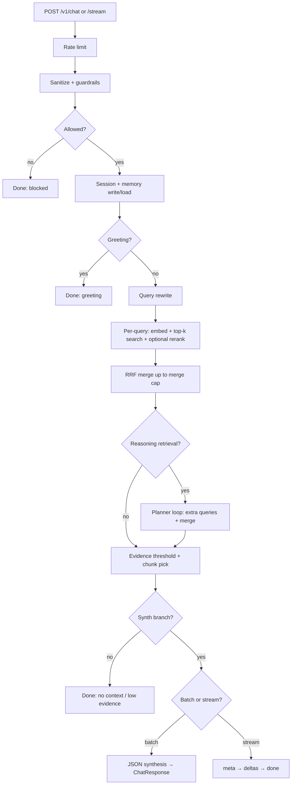

# Chat and chat-stream pipelines

This document describes how **`POST /v1/chat`** (JSON) and **`POST /v1/chat/stream`** (SSE) execute for one user turn, including retrieval limits, query rewrite behavior, and related settings.

Primary code paths:

- HTTP: `copilot_iitb/api/routes/chat.py`
- Orchestration: `copilot_iitb/application/chat_service.py` → `copilot_iitb/application/chat_agent.py`
- Vector retrieval: `copilot_iitb/infrastructure/langchain/vector_retriever.py`
- Wiring (rerank, rewriters): `copilot_iitb/api/main.py`

---

## Shared prerequisites

Both endpoints:

1. Apply **`InMemoryRateLimiter`** using `rate_limit_per_minute` (default **120**).
2. Accept **`ChatRequest`**: `session_id`, optional `user_id`, `message`, optional `metadata_filters` (must match chunk metadata for retrieval).
3. Run the **same** core pipeline in `ChatAgent` until generation; only the **final answer step** differs (batch JSON vs streaming text).

---

## Step-by-step: common pipeline (`ChatAgent._execute_until_chunk_selection`)

| Step | What happens | Notable settings / limits |
|------|----------------|---------------------------|
| **1. Rate limit** | Per-client minute cap | `RATE_LIMIT_PER_MINUTE` |
| **2. Input sanitization** | `InputGuard.asanitize_user_message` | — |
| **3. Content policy** | `aevaluate_input_policy` (phrase blocklist, injection regex) | `GUARDRAIL_*` settings |
| **4. Policy block branch** | If blocked: create/resolve session, append memory, return canned response | `GUARDRAIL_BLOCKED_RESPONSE` |
| **5. Session** | Resolve `session_id` or create session; touch activity | `ValueError` → HTTP 400 if unknown session |
| **6. Short-term memory** | Append user message | — |
| **7. Context load** | Short-term (max **20** messages loaded), episodic (**12** turns loaded; summary uses last **4**), optional long-term hints (**4** hints, needs `user_id`) | `SHORT_TERM_MAX_MESSAGES`, episodic/limit fixed in code |
| **8. Recent dialogue slice** | Last **`LLM_CONTEXT_RECENT_TURNS`** messages (default **6**) formatted for planners | `LLM_CONTEXT_RECENT_TURNS` |
| **9. Greeting short-circuit** | Regex match on short messages | `ENABLE_GREETING_SHORT_CIRCUIT`, `GREETING_REGEX`, `GREETING_MAX_MESSAGE_CHARS` (default **160**), `GREETING_RESPONSE` |
| **10. Query rewrite** | `IQueryRewriter.arewrite` → `base_queries` | See **Query rewrite** below |
| **11. Vector retrieval (multi-query)** | For each query: embed → vector search → optional rerank; results merged with **RRF** | See **Retrieval per query** and **Merge** below |
| **12. Iterative retrieval planner** | Optional extra rounds of vector search | See **Reasoning planner** below |
| **13. Evidence gate** | Best signal vs `MIN_EVIDENCE_SIMILARITY` (default **0.22**); empty chunks → no-context path | `MIN_EVIDENCE_SIMILARITY`, `NO_CONTEXT_ANSWER`, `LOW_EVIDENCE_*` |
| **14. Chunk selection for synthesis** | Sort by `rerank_similarity` / `vector_similarity` / score; pick up to **K** with **max 2 chunks per `document_id`** | Effective **K** = `RETRIEVAL_TOP_K`, capped at **5** when `DOCUMENT_ASSISTANT_MODE=true` |

---

## Query rewrite

| Mode | Behavior | Query count |
|------|-----------|-------------|
| **`DOCUMENT_ASSISTANT_MODE=true`** (default) | **`HeuristicQueryRewriter`**: no LLM; single query = sanitized user text (deduped) | **1** query |
| **`DOCUMENT_ASSISTANT_MODE=false`** and **`ENABLE_QUERY_REWRITE=true`** with LLM configured | **`OpenAIQueryRewriter`**: LLM returns `search_queries`; capped by **`QUERY_REWRITE_MAX_VARIANTS`** (default **3**, max **8**) | **1–`QUERY_REWRITE_MAX_VARIANTS`** |
| **`ENABLE_QUERY_REWRITE=false`** | Heuristic (same as assistant mode for rewrite) | **1** |

Prompt contract for LLM rewrite asks for **1–3** distinct strings; code enforces max variants via `QUERY_REWRITE_MAX_VARIANTS`.

Related: `QUERY_REWRITE_TEMPERATURE` (default **0.1**).

---

## Retrieval per query (`LangChainVectorRetriever.aretrieve`)

For **each** search string:

1. **Embed** the query (provider from `EMBEDDING_PROVIDER` / Azure / OpenAI / Pinecone / local).
2. **Vector search** with **`k = RETRIEVAL_TOP_K`** (default **8**, range 1–50).
3. **Post-filter** by `metadata_filters` from the chat request (equality on metadata keys).
4. **Trim to `FUSION_TOP_K`** ordered hits (default **5**) before building chunk list — this is the pool passed to reranking.
5. **Rerank** (if enabled): cosine similarity query embedding vs chunk text embeddings; keep top **`RERANK_TOP_N`** (default **8**); chunk text truncated to **`RERANK_CHUNK_CHAR_LIMIT`** (default **1600**) for embedding.

**Document assistant mode** (`DOCUMENT_ASSISTANT_MODE=true`):

- **`ENABLE_EMBEDDING_RERANK` is ignored for wiring**: app uses **`NoOpReranker`** (no extra embed pass for rerank).
- **`FUSION_TOP_K`** is validated to **`min(configured, 5)`** in settings.

---

## Merge across queries (`ChatAgent._retrieve_merged_queries`)

- Each query’s hits are sorted by relevance signal, then merged with **RRF** (Reciprocal Rank Fusion) with internal **`k = 60`** (code constant, not `RETRIEVAL_TOP_K`).
- Maximum distinct chunks after fusion: **`RETRIEVAL_MERGE_CAP`** (default **24**), but with **`DOCUMENT_ASSISTANT_MODE=true`** the effective cap is **`min(RETRIEVAL_MERGE_CAP, 12)`**.

---

## Reasoning planner (extra retrieval rounds)

Enabled only when **`DOCUMENT_ASSISTANT_MODE=false`**, **`ENABLE_REASONING_RETRIEVAL=true`**, and an LLM is configured.

| Setting | Default | Role |
|---------|---------|------|
| `REASONING_MAX_ITERATIONS` | **3** | Max planner loops (0 disables loop body) |
| `REASONING_MAX_FOLLOW_UP_QUERIES_PER_STEP` | **3** | Cap on new queries per iteration |

Each iteration sends excerpts from the current top **12** chunks (**520** chars each) to the planner; new queries trigger more `aretrieve` calls and another RRF merge into the same merge cap.

If disabled: **`NoOpRetrievalPlanner`** returns `sufficient=true` immediately → **no** extra queries.

---

## Paths that skip streaming tokens

These return a final **`RAGAnswer`** inside `_execute_until_chunk_selection` (no LLM synthesis):

- Guardrail **policy block**
- **Greeting** short-circuit
- **No chunks** after retrieval
- **Low evidence** (best similarity strictly below `MIN_EVIDENCE_SIMILARITY`)

For **`/v1/chat/stream`**, these emit a **single SSE event**:

```json
{"type":"done","session_id":"...","result":{...},"retrieval_debug":{...}}
```

(no `meta` / `delta`).

---

## `POST /v1/chat` (batch)

After chunk selection, if the branch is **synthesize**:

1. **`IAnswerSynthesizer.asynthesize`** — OpenAI/Azure chat with **`response_format: json_object`**, system prompt from **`RAG_SYSTEM_PROMPT`** + **`RAG_INSTRUCTION_PRIORITY_ADDON`**.
2. **`RAG_SYNTHESIS_TEMPERATURE`** (default **0.2**), **`RAG_SYNTHESIS_MAX_OUTPUT_TOKENS`** (default **512**), **`RAG_SYNTHESIS_TIMEOUT_SECONDS`** (default **45**).
3. Parsed **`RAGAnswer`**; if model omits citations, filled from selected chunks.
4. Persist assistant turn (short-term + episodic).

Returns **`ChatResponse`**: `session_id`, `result`, optional **`retrieval_debug`** (search queries, tried queries, chunk counts, reasoning trace, timing).

---

## `POST /v1/chat/stream` (SSE)

Same pipeline through retrieval and chunk selection.

**When synthesizing:**

1. First event: **`{"type":"meta","session_id","retrieval_debug"}`** — retrieval debug **before** generation.
2. Then zero or more **`{"type":"delta","text":"..."}`** from **`asynthesize_stream`**.
3. Final **`{"type":"done","session_id","result","retrieval_debug"}`** — `result` is a **`RAGAnswer`** shape; answer text is concatenated deltas (trimmed); if empty, falls back to **`NO_CONTEXT_ANSWER`**.
4. Streaming uses a **modified system prompt** that asks for **plain text/markdown**, not JSON (`structured_synthesizer.py`).
5. Citations in the streamed `done` result are built from **selected retrieved chunks** (`_chunks_to_citations`), not from model JSON.

Short-circuit paths emit **`done` only** (documented in route docstring).

Transport: `StreamingResponse` with `media_type=text/event-stream`; each line `data: <json>\n\n`.

---

## Synthesis / LLM reliability (both modes)

| Setting | Default |
|---------|---------|
| `LLM_MAX_RETRIES` | **3** |
| `LLM_RETRY_BACKOFF_BASE_SECONDS` | **0.6** |

(Used by JSON helper paths such as query rewrite / planner; synthesizer uses direct client calls with synthesis timeout.)

---

## Quick reference: env vars mentioned above

| Env / field | Default | Meaning |
|-------------|---------|---------|
| `DOCUMENT_ASSISTANT_MODE` | **true** | Fast path: no LLM rewrite, no embedding rerank, smaller merge/synthesis caps |
| `RETRIEVAL_TOP_K` | **8** | Vector search `k` |
| `FUSION_TOP_K` | **5** (≤5 if doc assistant) | Candidates per query before rerank |
| `RETRIEVAL_MERGE_CAP` | **24** (effective ≤12 if doc assistant) | Max chunks after multi-query RRF |
| `RERANK_TOP_N` | **8** | After cosine rerank (full pipeline only) |
| `RERANK_CHUNK_CHAR_LIMIT` | **1600** | Text length embedded for rerank |
| `ENABLE_EMBEDDING_RERANK` | **true** | Overridden off when doc assistant mode |
| `MIN_EVIDENCE_SIMILARITY` | **0.22** | Threshold for low-evidence response |
| `ENABLE_QUERY_REWRITE` | **true** | No effect while doc assistant uses heuristic rewriter |
| `QUERY_REWRITE_MAX_VARIANTS` | **3** | Max rewritten queries from LLM |
| `ENABLE_REASONING_RETRIEVAL` | **false** | Iterative planner |
| `REASONING_MAX_ITERATIONS` | **3** | Planner loop bound |
| `REASONING_MAX_FOLLOW_UP_QUERIES_PER_STEP` | **3** | New queries per planner step |
| `SHORT_TERM_MAX_MESSAGES` | **20** | Loaded window |
| `LLM_CONTEXT_RECENT_TURNS` | **6** | Recent dialogue for rewrite/planner context |
| `RAG_SYNTHESIS_MAX_OUTPUT_TOKENS` | **512** | Completion cap |
| `RAG_SYNTHESIS_TEMPERATURE` | **0.2** | Synthesis sampling |
| `RAG_SYNTHESIS_TIMEOUT_SECONDS` | **45** | Synthesis HTTP timeout |
| `CHAT_SLOW_TURN_WARNING_MS` | **1000** | Log warning threshold for turn duration |
| `RATE_LIMIT_PER_MINUTE` | **120** | Chat endpoints |

---

## Diagram (high level)



---

*Generated from codebase scan; defaults refer to `copilot_iitb/config/settings.py` as of this repo revision.*
